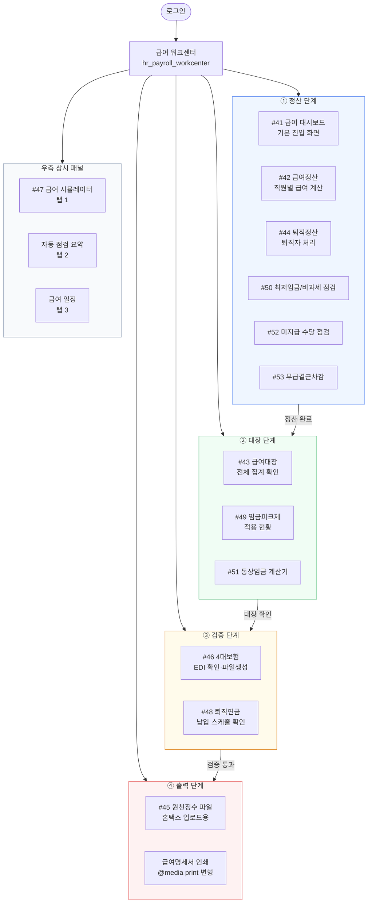

# Before / After — hr_payroll_workcenter

**Phase**: 3 / Group ①
**통합 전**: 13개 독립 화면 (#41~#53)
**통합 후**: 1개 워크센터 (`hr_payroll_workcenter`)

---

## 13개 화면 → 단계/패널/탭 매핑 표

| 원래 화면 | 화면 ID | 통합 위치 | 단계 | 진입 방법 |
|---|---|---|---|---|
| 급여대시보드 | #41 | **STEP 1 > 정산** 기본 뷰 | 1-정산 | 좌측 네비 "대시보드 (#41)" |
| 급여정산 | #42 | **STEP 1 > 정산** 서브뷰 | 1-정산 | 좌측 네비 "급여정산 (#42)" |
| 급여대장 | #43 | **STEP 2 > 대장** 서브뷰 | 2-대장 | 좌측 네비 "급여대장 (#43)" |
| 퇴직정산 | #44 | **STEP 1 > 정산** 서브뷰 | 1-정산 | 좌측 네비 "퇴직정산 (#44)" |
| 원천징수파일 | #45 | **STEP 4 > 출력** 서브뷰 | 4-출력 | 좌측 네비 "원천징수 파일 (#45)" |
| 4대보험 | #46 | **STEP 3 > 검증** 서브뷰 | 3-검증 | 좌측 네비 "4대보험 (#46)" |
| 시뮬레이터 | #47 | **우측 사이드 패널** 탭 1 | — | 패널 "시뮬레이터" 탭 |
| 퇴직연금 | #48 | **STEP 3 > 검증** 서브뷰 | 3-검증 | 좌측 네비 "퇴직연금 (#48)" |
| 임금피크제 | #49 | **STEP 2 > 대장** 서브뷰 | 2-대장 | 좌측 네비 "임금피크제 (#49)" |
| 최저임금/비과세 점검 | #50 | **STEP 1 > 정산** 서브뷰 | 1-정산 | 좌측 네비 "최저임금/비과세 (#50)" |
| 통상임금 계산기 | #51 | **STEP 2 > 대장** 서브뷰 | 2-대장 | 좌측 네비 "통상임금 계산기 (#51)" |
| 미지급 수당점검 | #52 | **STEP 1 > 정산** 서브뷰 | 1-정산 | 좌측 네비 "미지급 수당 (#52)" |
| 무급결근차감 | #53 | **STEP 1 > 정산** 서브뷰 | 1-정산 | 좌측 네비 "무급결근차감 (#53)" |

---

## 단계별 구성 요약

| 단계 | 포함 화면 | 역할 |
|---|---|---|
| **1. 정산** | #41 #42 #44 #50 #52 #53 | 데이터 입력·계산·이슈 확인 |
| **2. 대장** | #43 #49 #51 | 정산 결과 확인·검토 |
| **3. 검증** | #46 #48 | 4대보험·퇴직연금 검증 |
| **4. 출력** | #45 + 명세서 인쇄 | 파일 생성·인쇄 |
| **우측 패널** | #47 (시뮬레이터) | 상시 접근 가능한 보조 도구 |

---

## 화면 흐름 다이어그램

---

## 주요 UX 변경 포인트

### Before (13개 분리 화면)
- 각 화면이 별도 메뉴 항목으로 존재 → 메뉴 뎁스 과다
- 급여정산 중 시뮬레이터를 보려면 다른 화면으로 이동 필요
- 정산 완료 여부를 한눈에 알 수 없음
- 최저임금·통상임금·미지급 수당이 분리되어 연계성 낮음

### After (1개 워크센터)
- 정산 → 대장 → 검증 → 출력의 **선형 흐름** 명확화
- 우측 사이드 패널로 시뮬레이터를 **상시 접근** (화면 이동 불필요)
- 대시보드에서 단계별 진행률·이슈 **한눈에 파악**
- 관련 화면들이 같은 단계 내 탭/서브뷰로 묶여 **컨텍스트 유지**
- 급여명세서 인쇄를 출력 단계 내 통합 → `@media print` 한 곳에서 관리

---

## 인쇄 변형이 작동하는 화면

| 파일 | 인쇄 진입 | 출력 내용 |
|---|---|---|
| `PC.html` | 상단 "인쇄" 버튼 → 명세서 뷰 자동 전환 → `window.print()` | 급여명세서 흑백 테이블 (지급/공제 2단 구성) |
| `PC.html` | `#view-payslip` 섹션 내 "인쇄" 버튼 | 동일 |
| `Mobile.html` | "명세서 인쇄" 버튼 → `window.print()` | 명세서 카드 흑백 출력 |
