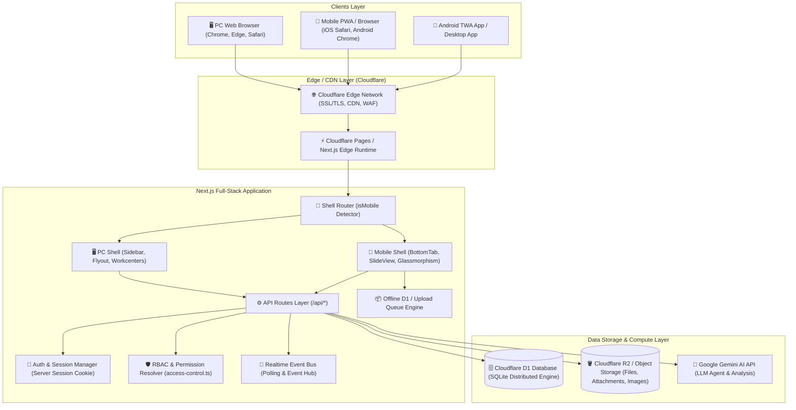
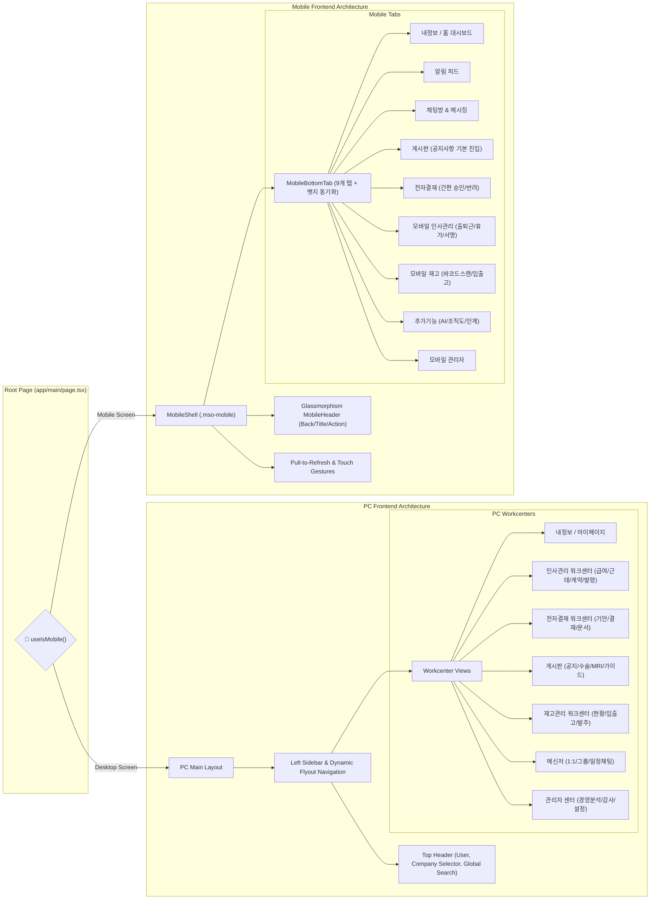
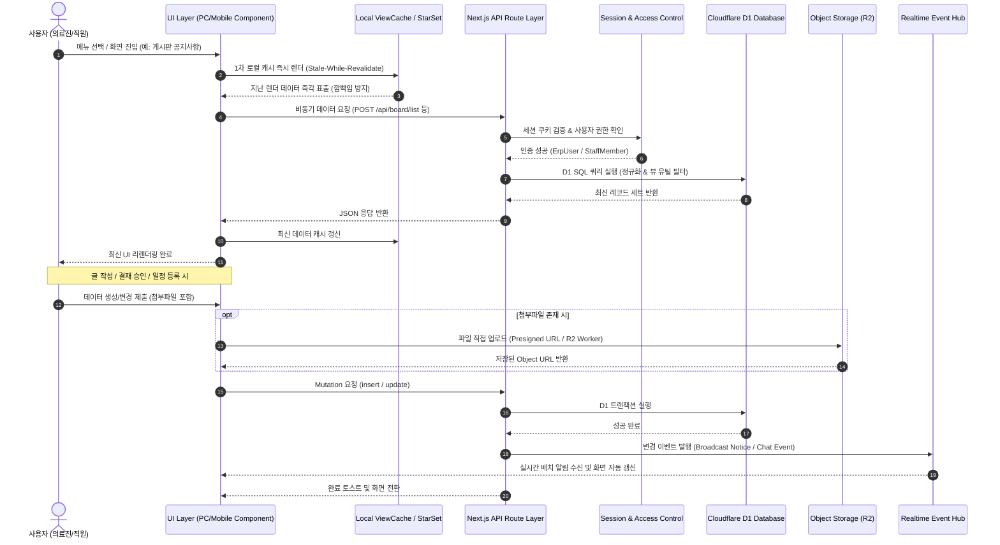
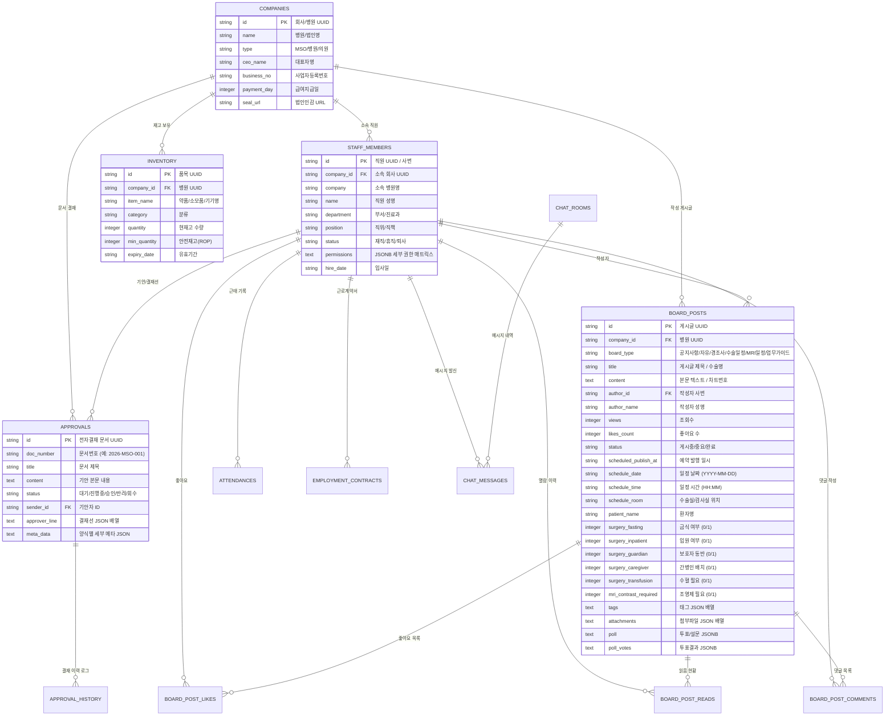
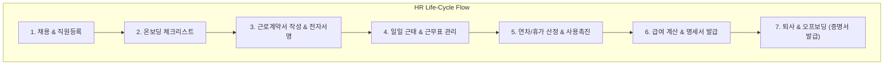
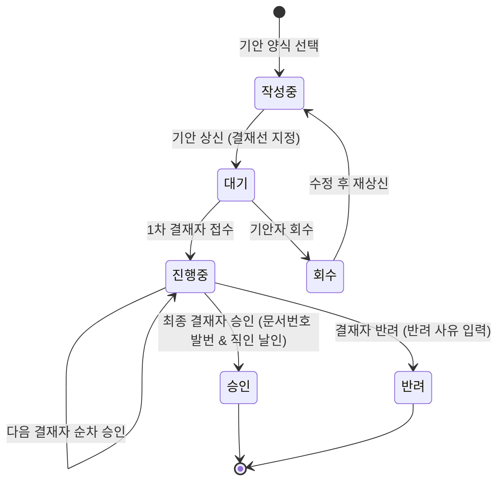
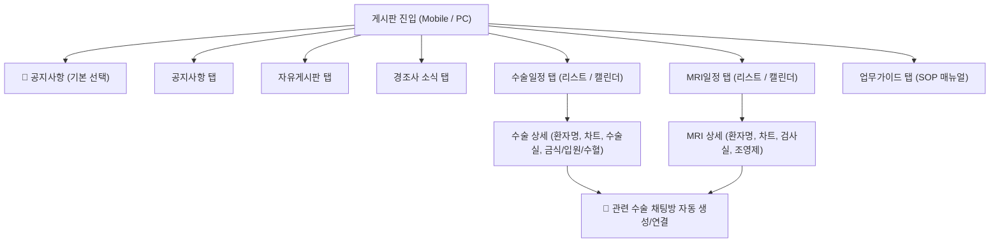

# MSO 통합 협업 및 다병원 운영 시스템 개발 계획서
## (MSO Enterprise Unified Hospital Operating Platform Specification & Architecture Plan)

---

## 📑 목차 (Table of Contents)

1. **시스템 개요 및 MSO 통합 철학 (System Overview & Philosophy)**
2. **시스템 전체 아키텍처 도면 (Overall Architecture Diagrams)**
   - 2.1 시스템 컨테이너 아키텍처 (System Container Diagram)
   - 2.2 듀얼 셸(PC / Mobile) 프론트엔드 구조도 (Dual-Shell Architecture)
   - 2.3 데이터 흐름도 (Data Flow Architecture)
3. **통합 데이터베이스 모델 및 ERD (Database Model & Core ERD)**
4. **도메인별 상세 기능 및 비즈니스 로직 (Domain Features & Logic)**
   - 4.1 MSO 전사 거버넌스 & 회사/조직 관리
   - 4.2 인사관리 워크센터 (HR Workcenter)
   - 4.3 전자결재 워크플로우 (Approval Engine)
   - 4.4 통합 게시판 & 수술/검사 캘린더 (Board & Schedule Engine)
   - 4.5 스마트 재고 및 의료자산 관리 (Inventory & Supply Chain)
   - 4.6 전사 실시간 메신저 & 알림 (Messenger & Notification Engine)
   - 4.7 추가기능 & Gemini AI 비서 (Extra Utilities & AI Engine)
   - 4.8 관리자 경영 분석 & 감사 센터 (Admin & Audit Center)
5. **보안, 권한 및 오프라인 동기화 로직 (Security, RBAC & Offline Sync)**
6. **향후 개발 및 고도화 로드맵 (Development Roadmap)**

---

## 1. 시스템 개요 및 MSO 통합 철학 (System Overview & Philosophy)

본 시스템은 **MSO(Management Service Organization, 병원경영지원회사)** 체계 아래 여러 병원·의원 및 관련 계열사들의 인사, 일정, 임상 지원, 물류, 결재, 커뮤니케이션을 **단일 통합 플랫폼(Single Unified Platform)**으로 일원화하여 운영 효율과 협업 시너지를 극대화하는 **차세대 병원 통합 운영 ERP**입니다.

### 🌟 핵심 기본 철학: "전사적 자원 및 데이터의 통합 공유 (Unified MSO Collaboration)"
1. **단일 테넌트 다기관 공유 모델 (Multi-Hospital Unified Sharing)**:
   - MSO 본사와 산하 각 병원은 격리된 사일로(Silo)가 아니라, 하나의 유기적인 연계 조직으로 동작합니다.
   - 의료진 파견, 환자 전원, 수술실/MRI 가동 현황, 비품/약품 재고, 전사 공지, 표준 업무 지침(SOP)을 전사적으로 실시간 공유합니다.
2. **PC & 모바일 완전 동기화 및 패리티 (Cross-Platform Parity)**:
   - 진료실·행정실의 PC 환경과 병동·수술실·이동 중의 모바일 환경에서 동일한 권한과 완결된 비즈니스 로직을 제공합니다.
3. **탄력적 오프라인 지원 및 고가용성 (Offline-First Resilience)**:
   - 네트워크 단절 상황에서도 조회 캐시 및 로컬 큐잉을 통해 진료 및 일정 확인에 차질이 없도록 설계되었습니다.

---

## 2. 시스템 전체 아키텍처 도면 (Overall Architecture Diagrams)

### 2.1 시스템 컨테이너 아키텍처 (System Container Diagram)

---

### 2.2 듀얼 셸(PC / Mobile) 프론트엔드 구조도

---

### 2.3 데이터 흐름도 (Data Flow Architecture)

---

## 3. 통합 데이터베이스 모델 및 ERD (Database Model & Core ERD)

---

## 4. 도메인별 상세 기능 및 비즈니스 로직 (Domain Features & Logic)

### 4.1 MSO 전사 거버넌스 & 회사/조직 관리
- **다병원 조직 구조 통합 관리**:
  - MSO 본사 및 각 산하 의료기관의 부서, 직위, 진료과 체계를 일원화하여 관리합니다.
  - 전사 조직도 뷰어(`extra_조직도`)를 통해 전 병원 임직원의 연락처, 부서, 직책을 실시간 검색합니다.
- **법인 직인 및 서식 중앙 관리**:
  - 병원별 대표 직인(`company_seals`), 로고, 양식 서식을 등록하여 전자결재 및 제증명서 발급에 자동 날인합니다.

---

### 4.2 인사관리 워크센터 (HR Workcenter)

1. **온보딩 / 근로계약서 전자서명 (`lib/contract-sign-complete.ts`)**:
   - 신규 입사자 등록 시 근로계약서 자동 생성 및 모바일 서명 패드 모달(`ContractSignatureModal`) 호출.
   - 서명 완료 즉시 PDF/이미지 스냅샷 저장 및 인사담당자 자동 알림 발송.
2. **출퇴근 & 스마트 근태 관리 (`app/main/기능부품/인사관리워크센터/AttendWorkcenter`)**:
   - GPS 지오펜싱 및 병원 IP 대역 검증을 통한 출퇴근 체크 (`check_in_time`, `check_out_time`).
   - 3교대(Day, Evening, Night) 근무표 자동 생성 및 교대 스케줄 변경 관리.
   - 지각·조퇴·이상 근태 감지 및 정정 신청/승인 프로세스.
3. **연차/휴가 자동 산정 및 법정 연차사용촉진제도**:
   - 근로기준법 제60조/제61조 기반 회계연도/입사일 기준 연차 자동 계산.
   - 1차 촉진(소멸 6개월 전 잔여일수 통보), 2차 촉진(소멸 2개월 전 사용시기 지정 요청) 자동화.
4. **급여 관리 & 이상치 분석 (`app/main/기능부품/인사관리워크센터/payroll`)**:
   - 기본급, 제수당(연장/야간/휴일/직책), 식대/차량 비과세, 4대보험, 소득세 원천징수 자동 계산.
   - 급여 이상치(전월 대비 급격한 증감, 최저임금 미달 등) 사전 검증.
   - 직원별 모바일 급여명세서 비밀번호 보안 조회.

---

### 4.3 전자결재 워크플로우 (Approval Engine)

- **다양한 표준 전자결재 서식**:
  - 휴가/연차신청서, 지출결의서, 물품구매신청서, 인사품의서, 시말서/사고보고서, 협조전 등.
- **다병원 간 협조전 결재**:
  - 타 병원 부서와의 업무 협조 및 MSO 본사 승인선이 연계된 결재 프로세스 지원.
- **모바일 간편 결재**:
  - 모바일 셸 결재 탭에서 터치 한 번으로 결재 문서 열람, 첨부파일 확인, 승인/반려 처리.

---

### 4.4 통합 게시판 & 수술/검사 캘린더 (Board & Schedule Engine)

1. **기본 진입 및 칩바 정책**:
   - 모바일/PC 진입 시 **'공지사항' 탭이 기본 활성화**되어 가장 중요한 공지를 즉시 확인.
   - 상단 카테고리 칩바: `공지사항` | `자유게시판` | `경조사` | `수술일정` | `MRI일정` | `업무가이드`.
2. **수술 및 MRI 검사 일정 통합 관리 (`app/main/모바일/게시판/일정달력.tsx`)**:
   - **월간 42칸 캘린더 그리드 & 일자별 환자 리스트**: 날짜별 수술/검사 건수 및 환자명 즉시 파악.
   - **상세 정보 완결 표출**: 환자명, 차트번호, 수술실/검사실 위치, 시간, 수술/촬영 준비 상태(금식, 입원, 보호자 동반, 간병인, 수혈 필요, 조영제 필요)를 직관적인 칩 뱃지로 렌더링.
   - **사람 모형 부위별 템플릿 선택기 (`BoardBodyPickerModal`)**: 3D/2D 인체 해부 모형을 통해 수술/검사 부위를 직관적으로 선택하여 표준 진료명 입력 지원.
   - **원클릭 협진 채팅방 연동**: 수술/검사 카드에서 클릭 시 해당 환자 수술 전용 그룹 채팅방을 자동 개설하여 집도의, 마취의, 수술실 간호사, 병동 간호사 간 실시간 소통.
3. **공지사항 예약 발행 및 중요 공지 고정**:
   - 지정된 일시에 자동 발행되는 예약 공지 기능 및 최상단 고정(Pin) 지원.
   - 공지/경조사 등록 시 전사 채팅방 및 푸시 알림 자동 방송(`broadcastNoticeIfNeeded`).
4. **투표 및 상품 추첨 엔진 (`board-poll-prize.ts`)**:
   - 복수선택/익명투표 지원 및 투표 참여자 대상 실시간 공정 추첨 알고리즘 내장.
5. **익명 읽음 상태 추적 (`BoardReadStatus`)**:
   - 전사 직원의 공지 열람 여부를 실시간 추적하여 미열람자 대상 리마인드 지원.

---

### 4.5 스마트 재고 및 의료자산 관리 (Inventory & Supply Chain)
- **약품/소모품/의료기기 통합 재고 추적**:
  - 병원별, 부서별 현재고 수량, 입출고 이력, 안전재고(ROP) 기준 미달 시 자동 발주 알림.
- **바코드 / QR / UDI 스캔 (`app/main/모바일/재고`)**:
  - 모바일 카메라를 통한 의약품·의료기기 표준 UDI 바코드 스캔 입출고 처리.
- **유통기한 추적 및 선입선출(FIFO) 관리**:
  - 유효기간 임박 품목 사전 경고 및 병원 간 재고 이관(Transfer) 지원.

---

### 4.6 전사 실시간 메신저 & 알림 (Messenger & Notification Engine)
- **1:1 대화 및 부서/프로젝트 채널**:
  - 실시간 타이핑 상태 표시, 파일/이미지/비디오 전송, 메시지 검색.
- **스마트 알림 시스템 (`notification-api.ts`)**:
  - 결재 도착, 댓글 등록, 공지사항 발행, 수술 일정 변경 등 주요 이벤트를 배너 및 모바일 뱃지로 실시간 전달.

---

### 4.7 추가기능 & Gemini AI 비서 (Extra Utilities & AI Engine)
- **Gemini 의료/경영 AI 어시스턴트**:
  - 의무기록 요약, 병원 행정 지침 질의응답, 약품 정보 검색, 데이터 통계 질의 지원.
- **인계노트 (Shift Handover)**:
  - 교대 근무 간 환자 특이사항, 처치 지시사항, 주의사항을 인계장으로 기록 및 확인.
- **ESL(전자가격표시기/전자네임택) 연동**:
  - 병동 베드 네임택, 진료실 전자 명패와 시스템 데이터 실시간 연동.

---

### 4.8 관리자 경영 분석 & 감사 센터 (Admin & Audit Center)
- **경영 대시보드 (`ExecDashboard.tsx`)**:
  - MSO 산하 병원별 환자 내원 추이, 수술 건수, 진료과별 매출 지표, 인건비 비율 등 종합 KPI 시각화.
- **변조 방지 감사 로그 (`audit_logs`, `access_logs`)**:
  - 개인정보 및 환자 정보 열람, 주요 결재 문서 수정, 권한 변경 이력을 타임스탬프와 함께 위변조 불가능하게 영구 기록.

---

## 5. 보안, 권한 및 오프라인 동기화 로직 (Security, RBAC & Offline Sync)

### 5.1 세분화된 RBAC 권한 매트릭스 (`lib/access-control.ts`)
- `role === 'admin'` / `isPrivilegedUser(user)` (시스템 마스터): 전사 최고 관리 권한.
- 각 기능별 세부 권한 키 매핑:
  - 게시판: `board_{보드명}_read`, `board_{보드명}_write`
  - 전자결재: `approval_기안함`, `approval_결재함`, `approval_작성하기`
  - 인사관리: `hr_구성원`, `hr_근태`, `hr_급여`, `hr_연차휴가`, `hr_계약`
  - 재고관리: `inventory_현황`, `inventory_등록`, `inventory_발주`, `inventory_월마감`

### 5.2 오프라인 퍼스트 동기화 엔진 (`lib/offline-queue-d1.ts`, `lib/offline-upload-queue.ts`)
- 네트워크가 불안정한 수술실/지하 검사실에서도 읽기 캐시(`readViewCache`)를 통해 데이터 즉시 조회.
- 오프라인 상태에서 발생한 변경사항(글 작성, 결재, 첨부파일)은 IndexedDB 로컬 큐에 안전하게 보관된 후, 네트워크 복구 시 백그라운드 자동 Flush 실행.

---

## 6. 향후 개발 및 고도화 로드맵 (Development Roadmap)

| 단계 | 목표 및 마일스톤 | 상태 |
| :--- | :--- | :---: |
| **Phase 1** | 모바일/PC 듀얼 셸 아키텍처 및 코어 ERP 모듈 구축 | ✅ 완료 |
| **Phase 2** | 모바일 게시판 공지사항 기본 진입 및 수술/MRI 일정 상세 정보 완결 렌더링 | ✅ 완료 |
| **Phase 3** | 다병원 통합 협업 캘린더 및 부위별 수술 템플릿 모델링 | ✅ 완료 |
| **Phase 4** | MSO 다병원 통합 경영 분석 대시보드 및 지표 비교 엔진 고도화 | 🔄 진행중 |
| **Phase 5** | Gemini AI 기반 의무기록 초안 작성 및 이상근태/재고 자동 예측 연동 | 📋 예정 |
| **Phase 6** | EMR/PACS 원내 의료 정보 시스템과의 표준 HL7/FHIR 인터페이스 연계 | 📋 예정 |

---

*본 문서는 MSO 통합 시스템의 단일 신뢰 원천(SSOT, Single Source of Truth) 개발 계획서로서, 전 개발 및 운영 단계의 표준 아키텍처 가이드라인으로 활용됩니다.*
